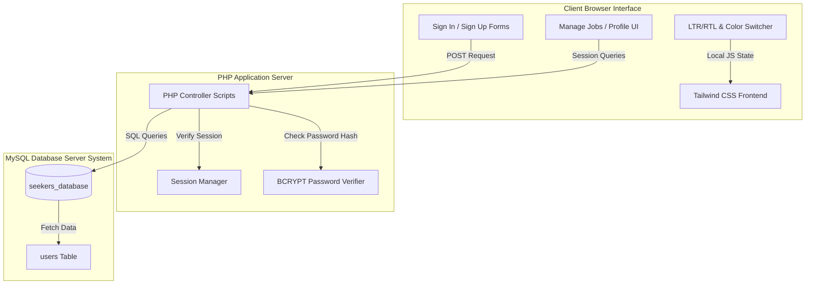
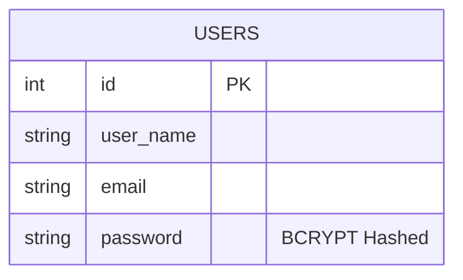

# 💼 Seekers Job Portal

An elegant, modern, and high-performance **Job Portal Web Application** designed to connect employers with job seekers. Built using a robust PHP backend, a MySQL database, and styled with a utility-first, fully responsive Tailwind CSS frontend, this application offers an extremely premium, dynamic user experience with advanced theme customization, RTL/LTR layout toggle, and seamless light/dark mode transitions.

🔗 **[Live Demo (Dummy Link)](https://seekers-job-portal.example.com)**

---

## 💡 Motivation
In today's highly competitive job market, finding the right talent or the perfect job can be overwhelming. Many existing job boards are cluttered, slow, and lack modern aesthetics, making the search stressful. **Seekers Job Portal** was built to humanize and streamline the recruitment process. The core motivation is to deliver a clutter-free, responsive, and visually stunning dashboard interface that makes job seeking and applicant management simple, efficient, and pleasant.

---

## 🎯 Problem Statement
Job seekers and employers face several pain points:
* **Information Overload:** Job portals often present massive amounts of unorganized data, leading to decision fatigue.
* **Lack of Layout Flexibility:** Most portals do not support adaptive layout directions (RTL for languages like Arabic/Urdu) or dark mode, which increases eye strain during prolonged searches.
* **Complex Onboarding:** Heavy and complex registration flows deter potential candidates.
* **Fragmented Job Tracking:** Candidates lack a centralized space to bookmark opportunities and track their active job applications.

### 🛡️ How Seekers Solves It:
1. **Curated Job Feeds:** Highly intuitive grids, lists, and filterable categories for instant job discovery.
2. **Visual Personalization:** An integrated dynamic settings panel allowing instant toggling between **Light/Dark modes**, **RTL/LTR layouts**, and **6 vibrant color themes** (Violet, Sky, Red, Green, Pink, Blue).
3. **Optimized PHP & MySQL Pipeline:** Secure, lightweight, and fast database-driven authentication and session tracking.
4. **Unified Dashboard:** Simple tabs to manage jobs, view saved/bookmarked jobs, and customize candidate profiles.

---

## ✨ Features

* **🛡️ Secure Authentication:** Password hashing using `BCRYPT` algorithms during user registration and verification.
* **🎨 Live Dynamic Customizer:** 
  * Instantly switch between **Light Mode** and **Dark Mode**.
  * Dynamic layout toggle supporting **LTR (Left-to-Right)** and **RTL (Right-to-Left)** directions.
  * Six custom primary color presets (Violet, Sky, Red, Green, Pink, Blue).
* **🔍 Advanced Job Search & Filters:** Dynamic categories, candidate grids, and interactive search listings.
* **🔖 Bookmark & Job Management:** Centrally track bookmarks and manage job history.
* **👤 Candidate Profile Management:** Edit personal profiles, professional titles, and contact information.
* **📱 Responsive Design:** Crafty mobile-first design that adapts seamlessly to desktop, tablet, and mobile screens.

---

## 🏗️ System Architecture & UML

Here is the high-level architecture and flow diagram representing the interaction between users, the PHP application controller, and the MySQL database:



### 🗃️ Database Entity Relationship (ERD)



---

## 📂 Folder Structure

The project directory has been flattened and organized cleanly:

```bash
seekers-job-portal/
├── assets/
│   ├── css/                 # Compiled Tailwind and Icon CSS files
│   ├── images/              # Layout, flags, and auth system asset illustrations
│   ├── js/                  # App initialization and theme switcher scripts
│   ├── libs/                # Dynamic plugins (PopperJS, Simplebar, Tailwind CSS)
│   └── php/                 # Auxiliary PHP backend scripts (e.g. contact form processing)
├── html/                    # Pure HTML view templates for prototyping
│   ├── index.html           # Mockup Dashboard
│   ├── sign-in.html         # Mockup Sign-in 
│   └── ...
├── .gitignore               # Standard exclusions (ignores node_modules, system logs)
├── bookmark-jobs.php        # Job bookmarking panel
├── index.html               # Main job discovery landing page
├── login.php                # Database authentication processor
├── manage-jobs.php          # User job management panel
├── profile.php              # Candidate profile manager
├── register.php             # New account registrar
├── savedata.php             # Global MySQL connection pool helper
├── sign-in.php              # Dynamic sign-in view
├── sign-out.php             # Session destroyer
└── sign-up.php              # Dynamic registration view
```

---

## 🚀 How to Run

Follow these simple steps to deploy and run **Seekers** locally:

### 📋 Prerequisites
* An active local web server environment like **XAMPP**, **WAMP**, or **Laragon**.
* PHP installed (PHP 7.4 or higher recommended).
* MySQL Database server running.

### 🔌 Database Setup
1. Open your database administration dashboard (typically `http://localhost/phpmyadmin`).
2. Create a new database named `seekers_database`:
   ```sql
   CREATE DATABASE seekers_database;
   ```
3. Run the following query to create the essential `users` table:
   ```sql
   USE seekers_database;

   CREATE TABLE users (
       id INT AUTO_INCREMENT PRIMARY KEY,
       user_name VARCHAR(100) NOT NULL UNIQUE,
       email VARCHAR(255) NOT NULL UNIQUE,
       password VARCHAR(255) NOT NULL
   );
   ```

### 💻 Local Deployment
1. **Clone the repository** (or copy the files) into your server's root web directory (e.g., `C:/xampp/htdocs/project_seekers-main`).
2. Verify the database configurations inside `savedata.php`, `register.php`, and `login.php`:
   ```php
   // Default settings:
   $hostName = "localhost";
   $dbUser = "root";
   $dbPassword = ""; // Empty password for XAMPP
   $dbName = "seekers_database";
   ```
3. Open your browser and navigate to the local site:
   ```bash
   http://localhost/project_seekers-main/index.html
   ```

---

## 🎨 Theme Customization
To customize primary colors, modes, or fonts globally:
* Core styles are compiled in [assets/css/tailwind.css](file:///c:/Users/User/Pictures/project_seekers-main/assets/css/tailwind.css).
* Dynamic switching scripts can be found in [assets/js/app.js](file:///c:/Users/User/Pictures/project_seekers-main/assets/js/app.js) and [assets/js/pages/switcher.js](file:///c:/Users/User/Pictures/project_seekers-main/assets/js/pages/switcher.js).
* Configurable theme classes are embedded directly in the html root attributes (e.g., `data-theme-color="violet"`, `data-mode="light"`, `dir="ltr"`).

---

## 📄 License
This project is open-source and available under the [MIT License](LICENSE).
